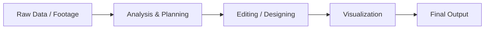

<div align="center">


</div>

---

# 📊 DATA ANALYST • 🎬 VIDEO EDITOR • 🎨 DESIGNER

<table>
<tr>
<td width="55%">

## 👨‍💻 About Me

- 🎓 BS Information Technology Student  
- 📊 Aspiring Data Analyst  
- 🎬 Video Editor using Movavi & DaVinci Resolve  
- 🎨 Passionate about Creativity and Design  
- 💻 Interested in Web Development & Databases  
- 🚀 Constantly Learning New Technologies  

</td>

<td width="45%">


</td>
</tr>
</table>

---

# 🧠 CURRENT FOCUS

```txt
📈 Data Visualization
🎬 Cinematic Video Editing
🎨 UI/UX Design
🗄 Database Management
💻 Front-End Development
📊 Analytics & Reporting
```

---

# 🛠 CREATIVE + TECH STACK

<div align="center">


</div>

<br>

<div align="center">


</div>

---

# 📈 ANALYTICS DASHBOARD

<div align="center">


</div>

---

# 🎬 CREATIVE WORKFLOW



---

# 📜 LICENSES & CERTIFICATIONS

| Certification | Platform |
|---|---|
| [🗄 NoSQL and DBaaS 101](https://courses.cognitiveclass.ai/certificates/248aeeeed9e440cd902730a721867949) | IBM Cognitive Class |
| [💾 SQL and Relational Databases 101](https://courses.cognitiveclass.ai/certificates/cb658a90f2f64e44ba949cfa5160d1c9) | IBM Cognitive Class |
| [☁ Oracle Data Platform Foundations Associate](https://catalog-education.oracle.com/ords/certview/sharebadge?id=00369F7A0D8A56B9C6F108BD3C6C9A8C4C9477CF2476B7BC26D388697B5CA930) | Oracle |

---

# 🌐 CONNECT WITH ME

<div align="center">

<a href="mailto:einslayupan17@gmail.com">

</a>

<a href="https://linkedin.com/in/yourprofile">

</a>

<a href="https://github.com/EinsLayupan19">

</a>

</div>

---

<div align="center">

## 💭 PERSONAL MOTTO

> *“Creativity tells the story. Data reveals the truth.”*

<br>


</div>
